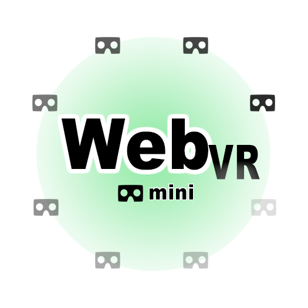

# 

### ...a mini library offering basic webgl and webvr support

This library illustrates how to get a WebVR installation up in barebones code, without any frameworks or JavaScript libraries, relying directly on the WebGL and WebVR libraries.

The goal was to create an app with a small download footprint that would allow experimentation in WebVR with simple worlds, without the overhead of a large library like [THREE.js](http://threejs.org). In addition, it is written in ES6 instead of ES5.

Sample project at: [Plyojump portfolio](http://plyojump.com/assets/projects/webvr-mini). Give it some time to load; this sample grabs some very large OBJ files.

## DOM Friendly

A key feature of WebVR mini is the ability to embed a WebGL scene in a standard DOM page, rather than attaching it as a fullscreen canvas typical of most frameworks. The requirement for a 3D scene to completely fill the browser window or screen is a problem when designing "Ux in VR" which provides WebVR as a progressive enhancement of a static image or 3D WebGL image. You can't just add the WebVR with a cameo 3D scene to an existing web page.

Most frameworks don't play nice with browser, which makes it difficult to insert a WebGL experience into a page other than as a link to another site. Given the likely uses of WebVR, this is a problem.

In contrast, WebVR mini can be added to regular web pages. When a "fullscreen" WebGL or WebVR experience is exited, the HTML5 canvas returns to to the DOM with its size determined by external CSS.

## Browser Support

Since WebVR Polyfill tries to grab the entire screen, the effect of including this library is unpredictable. This also restricts the library to running with native WebVR implementations. You can check current browser support at [WebVR Rocks](https://webvr.rocks/)

Webvr mini is experimental, and is NOT a replacement for comprehensive libraries like [THREE](http://threejs.org), [A-Frame](http://aframe.io) or [PrimroseVR](http://primrosevr.com).

## Building

The dev environment uses WebPack. Gulp might be a better choice, but errors can crash gulp silently so you continue to edit while your bundle is not updated. Since development with WebGL and WebVR causes a lot of crashes, using WebPack and the WebPack development server seemed a better choice.

```
npm install webpack -g
npm install webpack-dev-server -g
npm install
```

## Development

To run debugging, use the following npm command (in a separate window)

```
npm run dev
```

To minify and run production, excluding debugging libraries, type.

```
npm run build
```

## Starting the server

Start webpack watching in first console window:

```
"start": "webpack-dev-server --inline --devtool eval --progress --colors --content-base dist"
```

## Checking things in the console

To see auto-updates, access using the dev server URL. NOTE: this will only show 
internal console.logs. You can't see objects attached to the window from here, since we 
are running in an <iframe>.

http://localhost:8080/webpack-dev-server/

To see the site without auto-updates, and with objects attached to the window object visible in the Console (really needed for debugging without a lot of unit tests), use:

http://localhost:8080

## Note on environment variables

Environment variables are passed in at npm, and re-worked in webpack.

"build": "cross-env BUILD_RELEASE=true BUILD_DEV=false webpack --config webpack-production.config.js -p",
"dev": "cross-env BUILD_RELEASE=false BUILD_DEV=true webpack",

__DEV__ means we are in a development environment

__RELEASE__ means we are in a production environment

## Sources

Royalty-free 3d models for testing from [CG Trader](https://www.cgtrader.com)

[Ui icons from The Noun Project](https://thenounproject.com/) (see individual credits in source).

## Default

The current version programmatically creates a world consisting of a bunch of shapes, both generated, and loaded from an OBJ file. 

## Future updates

WebVR mini is currently being updated to include a better way of creating and saving worlds, as well as streaming WebGL asset loading.

## References

[WebGL Fundamentals from TWGL](http://webglfundamentals.org/)

[TWGL Docs](http://twgljs.org/)

[Learning WebGL](http://learningwebgl.com/blog/?page_id=1217)

[Barebones WebGL Routines (e.g. the font-loader in ui.js)](https://github.com/williame/barebones.js/tree/gh-pages/barebones.js)

[Cinematic Camera Movement (three.js)](https://nathanselikoff.com/2552/code-sketches/basic-camera-movement-three-js-webgl)

[First-Person Camera](https://github.com/shama/first-person-camera)

[Building an OpenGL Game from Scratch](http://crongdor.com/2016/04/01/making-the-game-from-scratch/)

[Some WebGL Samples, including dynamic clouds](https://www.ibiblio.org/e-notes/webgl/webgl.htm)

## Development Notes

The following lists some of the design patterns and techniques applied in development.

### Use of Fetch API and Promises


### Emitters

WebVR-Mini uses an emitter object (concept borrowed from webvr-polyfill) to broadcast events. Possible events include:

OBJ Loading

The GEOMETRY_READY is fired when a geometry (defined as coordinates for vertices, textures, normals, tangents) completes loading, either from procedural geometry or an OBJ file. OBJ files may load material files, which in turn fire MATERIAL_READY events when a Material (as defined by the OBJ Wavefront format) is read from a .mtl file. In the case the Material file references a texture, the texture is loaded and options from the .mtl file are passed to the TexturePool as an "options" object. Individual textures fire a TEXTURE_READY event and carry this options file along with them to PrimFactory


